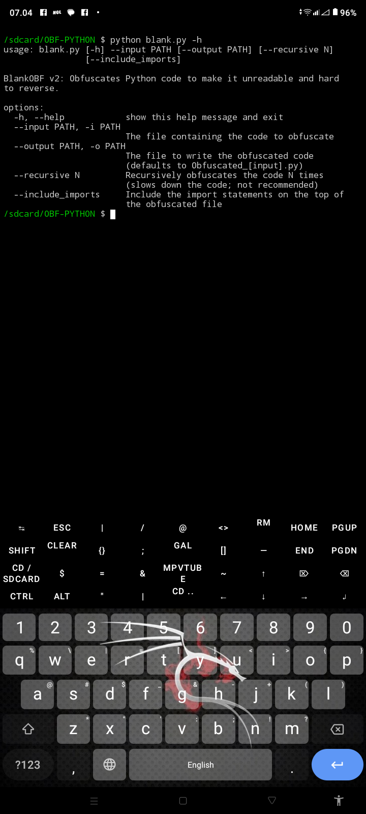
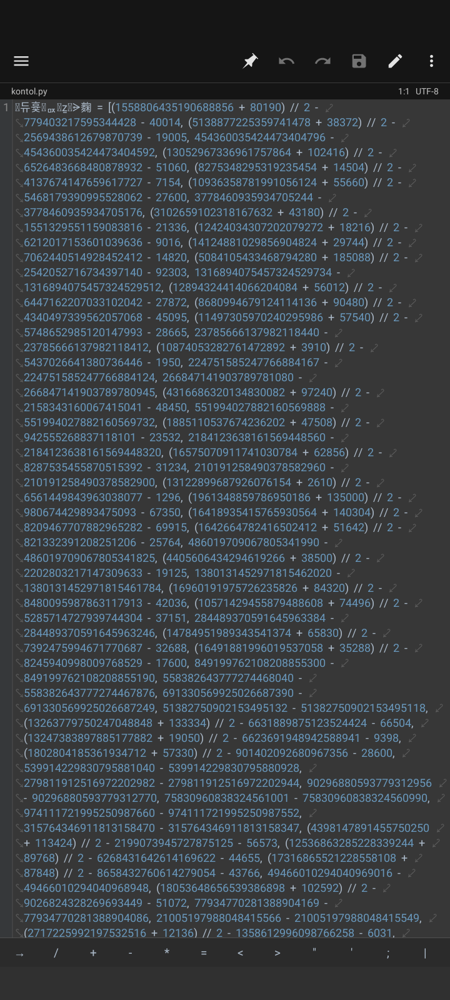

---

# 🧠 BlankOBF v2 — Extreme Python Obfuscator 🔒

> **Next-Gen Python Code Protection** — powered by abstract syntax tree (AST) mutation & layered compression.  
> Melindungi source code kamu dari *reverse-engineering* dan *decompilation* dengan teknik kompleks dan random aliasing.

---

## ✨ Features

- 🌀 **Recursive Obfuscation Layering**  
  Kode bisa diobfuscate berkali-kali untuk tingkat keamanan yang ekstrem.

- 🧩 **AST Mutation Engine**  
  Struktur kode diubah total tanpa mengubah fungsi aslinya.

- 🔁 **Alias Randomizer**  
  Nama variabel, fungsi, dan kelas diganti jadi karakter acak yang valid.

- 📦 **Compressed Payload Mode**  
  Output dikompresi dan dienkode dengan `zlib + base64`.

- ⚡ **Easy CLI Usage**  
  Jalankan langsung dari terminal dengan argumen sederhana.

---

## 🚀 Cara Penggunaan

```bash
python obfuscate.py --input script.py --output hasil.py --recursion 2

> Gunakan --recursion untuk tingkat kedalaman obfuscation.
Contoh: --recursion 3 = lapisan lebih dalam = lebih sulit dibaca.


---

🧰 Contoh Penggunaan

📸 Tutorial Menjalankan Obfuscator

> Gambar di bawah menunjukkan cara menjalankan BlankOBFv2 di terminal.


<p align="center">
  
</p>
---

🔐 Hasil Akhir File yang Sudah Diobfuscate

> Setelah proses selesai, kamu akan mendapatkan file Python baru dengan struktur super rumit seperti ini:


<p align="center">
  
</p>
---

⚙️ Argumen Lengkap

Argumen	Deskripsi

--input	File Python yang akan diobfuscate
--output	Nama file hasil obfuscation
--recursion	Jumlah lapisan obfuscation (default: 1)
--include-imports	Sertakan module random tambahan (opsional)


---

🧩 Struktur Proyek

BlankOBFv2/
├── obfuscate.py
├── core/
│   ├── encoder.py
│   ├── mutator.py
│   └── utils.py
└── assets/
    ├── 1.jpg  ← Tutorial Run
    └── 2.jpg  ← Hasil File


---

⚠️ Catatan

Hasil obfuscation tidak dapat dikembalikan ke bentuk semula.

Gunakan hanya untuk keperluan legal dan keamanan source code sendiri.

Performanya bisa sedikit menurun pada script besar dengan rekursi tinggi.


---

💬 Support & Kontribusi

Kalau kamu suka project ini, kasih ⭐ di GitHub!
Atau bantu dengan ide baru, bugfix, dan pull request.


---

<p align="center">
  <b>Developed with ❤️ by Hanz8k</b><br>
  <sub>Protect your code, protect your ideas.</sub>
</p>
```
---